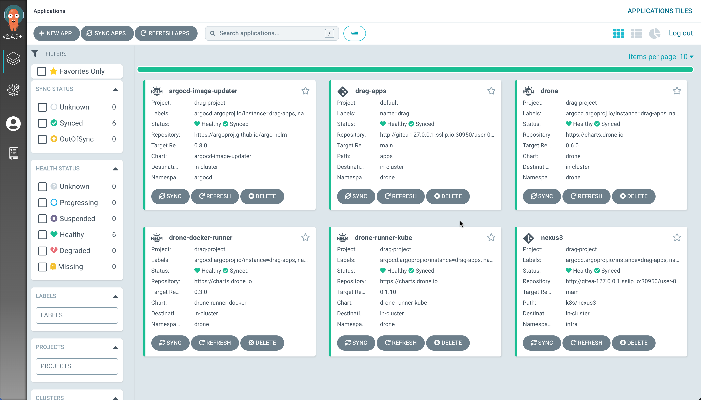

# GitOps on K3s

Setup kit to get started with [Gitops](https://about.gitlab.com/topics/gitops/) on your laptops using,

- [k3D](https://k3d.io) as the Kubernetes Cluster
- [k3s managed registry](https://k3d.io/v5.4.6/usage/registries/) for local container registry
- [Drone](https://drone.io) for Continuous Integration
- [ArgoCD](https://argo-cd.readthedocs.io/) for Gitops
- [Gitea](https://gitea.io/) for Source Control Management
  
This demo also shows how to use the Argo CD [declarative setup](https://argo-cd.readthedocs.io/en/stable/operator-manual/declarative-setup/) to setup [Drone](https://drone.io) with Drone Kubernetes runner.

The stack also deploys [ArgoCD Image Updater](https://argocd-image-updater.readthedocs.io/en/stable) to enable updating the application images via GitOps.

## Required Tools

- [Docker Desktop](https://www.docker.com/products/docker-desktop/)
- [k3d](https://k3d.io/)
- [Helm](https://helm.sh/)
- [Kustomize](https://kustomize.io/)
- [httpie](https://httpie.io/)
- [envsusbst](https://www.man7.org/linux/man-pages/man1/envsubst.1.html)

All linux distributions adds **envsubst** via [gettext](https://www.gnu.org/software/gettext/) package. On macOS it can be installed using [Homebrew](https://brew.sh/) like `brew install gettext`.

- [Argo CD CLI](https://github.com/argoproj/argo-cd/releases/latest)
- [direnv](https://direnv.net/)
- [yq](https://github.com/mikefarah/yq)
- [jq](https://stedolan.github.io/jq/)
- [stern](https://github.com/wercker/stern)

### dnsmasq

In order push and pull images from the [local registry](https://k3d.io/v5.4.6/usage/registries/#using-a-local-registry) setup dnsmsql and configure the localhost resolver,

```shell
brew install dnsmaq
```

Edit `/opt/homebrew/etc/dnsmasq.conf` and append `address=/.localhost/127.0.0.1`.

```shell
sudo mkdir -p /etc/resolver/localhost
sudo tee /etc/resolver/localhost > /dev/null <<EOF
nameserver 127.0.0.1
domain localhost
search_order 1
EOF
```

## Cluster Bootstrapping

The cluster bootstrapping  that we did in earlier step installs the core GitOps applications ([App of Apps](https://argo-cd.readthedocs.io/en/stable/operator-manual/declarative-setup/#app-of-apps)).

The following applications forms the core/base applications for effective GitOps,

- Argo CD Image Updater
- Drone Server
- Droner Runners
- k3D managed Container Registry
- Sigstore Policy Controller

A successful ArgoCD Deployment should look like,



### Do some GitOps

__TODO__ add some example GitOps Repositories.